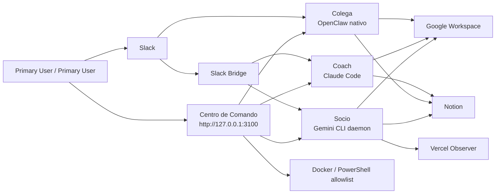

# Cubides Agents

Sistema local multi-agente para asistencia académica, desarrollo personal y estrategia de negocio. El proyecto corre en Windows + Docker Desktop y combina tres agentes con arquitecturas distintas porque sus objetivos, herramientas y modelos también son distintos.

## Estado Ejecutivo

| Agente | Propósito | Runtime | Canal principal | Modelo estándar | Estado |
| --- | --- | --- | --- | --- | --- |
| Colega | Docencia, investigación, reputación académica | OpenClaw nativo | Slack nativo + OpenClaw UI | `openai-codex/gpt-5.4` | Operativo |
| Coach | Salud, hábitos, relaciones, freelance técnico y apoyo al stack | Claude Code CLI | Slack Bridge + CLI | `sonnet` | Operativo |
| Socio | Negocio, crecimiento de proyectos, Vercel y estrategia comercial | FastAPI API + daemon Gemini CLI | Slack Bridge + API local | `gemini-2.5-flash` | Operativo |
| Socio Heavy | Navegación visual y tareas GUI bajo demanda | Ubuntu + VNC + Gemini | noVNC | manual | Experimental |
| Centro de Comando | Control visual, health, logs y acciones allowlist | Next.js local | Web local | N/A | Operativo |

La referencia viva está en [docs/current-state.md](D:/Agents/docs/current-state.md).

## Principios De Diseño

- **Diversidad deliberada:** no se unifican los agentes. Colega usa OpenClaw, Coach usa Claude Code y Socio usa Gemini/daemon.
- **Nativo primero:** cada agente debe usar las integraciones propias de su runtime/ecosistema cuando existan y estén maduras. Las herramientas compartidas de `agent_tools/` son fallback, capa de verificación o puente temporal salvo instrucción explícita en contra.
- **Local-first:** todos los puertos quedan en `127.0.0.1`; Slack usa Socket Mode y no requiere exponer endpoints públicos.
- **Autonomía controlada:** los agentes pueden ejecutar tareas propias dentro de límites locales, secretos cifrados y herramientas allowlist.
- **Memoria con fronteras:** se separa memoria curada, runtime y artefactos para evitar que los agentes lean basura vieja.
- **Canal diario:** Slack es el canal principal; las interfaces web quedan para inspección, control o tareas especiales.

## Arquitectura



## Componentes Principales

| Carpeta | Rol |
| --- | --- |
| `academic_agent/` | Perfil, rutinas e instrucciones de Colega para OpenClaw. |
| `personal_agent/` | Memoria, reglas y configuración de Coach para Claude Code. |
| `business_agent/` | FastAPI local, daemon Gemini CLI, identidad, memoria y estado de Socio. |
| `dashboard/` | Centro de Comando visual en Next.js. |
| `slack_bridge/` | Bridge local Socket Mode para Coach, Socio y audio de Colega cuando aplica. |
| `agent_tools/` | Herramientas comunes: Notion, Google Workspace, Vercel, voz, visión, deep research y correo. |
| `scripts/` | Automatización PowerShell para iniciar, validar, configurar y diagnosticar. |
| `docs/` | Documentación operativa y técnica. |

## Inicio Rápido

Desde `D:\Agents`:

```powershell
.\scripts\start-command-center.ps1
```

Ese launcher intenta abrir el Centro de Comando y preparar el entorno visible. Si prefieres arrancar partes específicas:

```powershell
.\scripts\start-academic.ps1
.\scripts\start-personal.ps1 -NoAttach
.\scripts\start-business.ps1 -NoBuild
.\scripts\start-slack-bridge.ps1 -Detached
.\scripts\start-voice-transcriber.ps1
.\scripts\start-dashboard.ps1
```

URLs locales:

| Servicio | URL |
| --- | --- |
| Centro de Comando | `http://127.0.0.1:3100` |
| Colega / OpenClaw | `http://127.0.0.1:18789` |
| Socio Lite | `http://127.0.0.1:8003` |
| Socio Heavy | `http://127.0.0.1:6080` |
| Voice Transcriber | `http://127.0.0.1:8011/health` |

## Seguridad Y Secretos

Los secretos viven cifrados con SOPS + AGE:

| Agente | Archivo cifrado | Runtime generado |
| --- | --- | --- |
| Colega | `secrets/academic.enc.yaml` | `secrets/runtime/colega.env` |
| Coach | `secrets/personal.enc.yaml` | `secrets/runtime/personal.env` |
| Socio | `secrets/business.enc.yaml` | `secrets/runtime/business.env` |

Reglas:

- No versionar `.env`, `.age/keys.txt` ni `secrets/runtime/*.env`.
- El dashboard exige `DASHBOARD_ADMIN_TOKEN` o `AGENT_ADMIN_TOKEN`; si no existe, falla cerrado.
- Los puertos están ligados a `127.0.0.1`.
- Socio es autónomo por decisión operativa (`SOCIO_AUTO_APPROVE=true`), documentado en `.env.example`.

Más detalle en [SECURITY.md](D:/Agents/SECURITY.md).

## Modelos Por Fase

| Agente | Fast | Standard | Deep | Experimental |
| --- | --- | --- | --- | --- |
| Colega | `openai-codex/gpt-5.4-mini` | `openai-codex/gpt-5.4` | `openai-codex/gpt-5.3-codex` | OpenClaw manual |
| Coach | `haiku` | `sonnet` | `opus` | `opusplan` para planificación |
| Socio | `gemini-2.5-flash-lite` | `gemini-2.5-flash` | `gemini-2.5-pro` | `gemini-3-*` solo manual |

Ver acceso real:

```powershell
.\scripts\discover-model-access.ps1 -RunProbes
```

## Integraciones Activas

| Servicio | Estado | Uso |
| --- | --- | --- |
| Slack | Activo | Conversación diaria, rutinas, audio, deep research. |
| Gmail | Activo por agente | Envío de correos dedicados. |
| Google Drive/Docs/Slides/Calendar | Implementado por OAuth; requiere `verify` OK | Investigaciones, documentos, presentaciones y calendarios propios. |
| Notion | Activo con mapa operativo | Tareas, gym, comida, interacciones, gastos, academia y negocio. |
| Vercel | Activo read-only para Socio | Proyectos, deploys, dominios y estado. |
| Voice Transcriber | Activo local | Transcripción gratuita/local de audios Slack. |

Guías:

- [docs/slack-integration.md](D:/Agents/docs/slack-integration.md)
- [docs/deep-research-google-workspace.md](D:/Agents/docs/deep-research-google-workspace.md)
- [docs/external-services-integration.md](D:/Agents/docs/external-services-integration.md)
- [docs/voice-transcription.md](D:/Agents/docs/voice-transcription.md)
- [docs/routine-conversations.md](D:/Agents/docs/routine-conversations.md)

## Operación Diaria

Validación rápida:

```powershell
docker compose ps
.\scripts\validate-personal.ps1
.\scripts\validate-notion.ps1 -Agent all -Search
node .\agent_tools\google_workspace.mjs --agent coach --action verify
node .\agent_tools\vercel_observer.mjs --action verify
```

Logs útiles:

```powershell
docker logs --tail 120 colega
docker logs --tail 120 personal
docker logs --tail 120 business_agent_daemon
Get-Content .\logs\slack-bridge.log -Tail 120
```

Runbook completo: [docs/operations-runbook.md](D:/Agents/docs/operations-runbook.md).

## Documentación

| Documento | Propósito |
| --- | --- |
| [docs/current-state.md](D:/Agents/docs/current-state.md) | Estado operativo real del stack. |
| [docs/operations-runbook.md](D:/Agents/docs/operations-runbook.md) | Comandos diarios, validación y troubleshooting. |
| [docs/runtime-data-boundaries.md](D:/Agents/docs/runtime-data-boundaries.md) | Separación entre memoria curada, runtime y artefactos. |
| [docs/agent-tools-catalog.md](D:/Agents/docs/agent-tools-catalog.md) | Catálogo de herramientas locales reutilizables. |
| [docs/slack-integration.md](D:/Agents/docs/slack-integration.md) | Slack apps, scopes, bridge y modos. |
| [docs/external-services-integration.md](D:/Agents/docs/external-services-integration.md) | Notion, GitHub, Vercel, Analytics y servicios externos. |
| [docs/deep-research-google-workspace.md](D:/Agents/docs/deep-research-google-workspace.md) | OAuth Google y runner de investigación profunda. |
| [SECURITY.md](D:/Agents/SECURITY.md) | Modelo de seguridad y respuesta a incidentes. |

## Roadmap Corto

1. Probar rutinas reales de mañana/noche por varios días y ajustar tono/memoria.
2. Reautorizar/validar Google Workspace cuando Google invalide refresh tokens OAuth.
3. Conectar GitHub con flujo de PR revisado por humano.
4. Conectar Analytics/Search Console a Socio con permisos read-only.
5. Auditar Colega non-root en entorno controlado o documentar por qué requiere root.
6. Mejorar telemetría real de tokens, costos y actividad.

## Licencia

Proyecto personal. Todos los derechos reservados.


